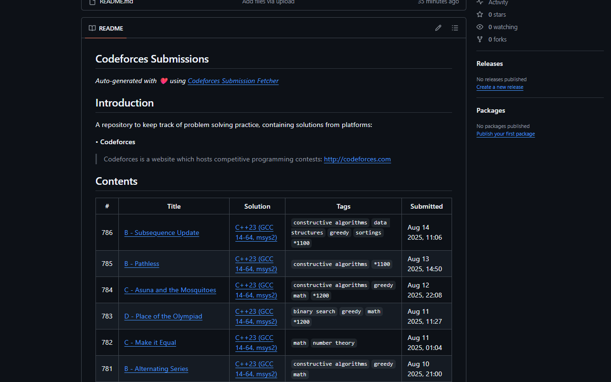
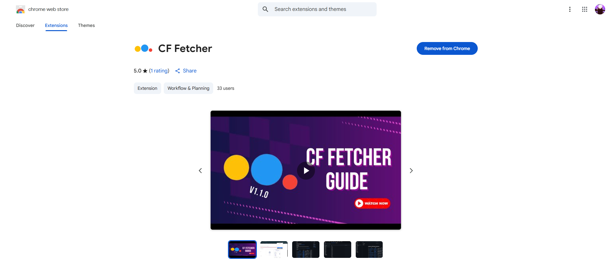

<h1>
  
    
  
  CF Fetcher
</h1>

<!-- &emsp; -->

A Chrome extension that fetches your Codeforces accepted submissions and generates a beautiful README.md file and you can upload it to your github repository.

---

## Features

- **Auto README Generation**: Creates a markdown table with your accepted submissions
- **Smart Filtering**: Only includes your latest accepted solution for each problem
- **Problem Details**: Shows difficulty ratings, tags, submission links and submission Time
- **Easy Setup**: Just enter your Codeforces credentials once

---

## Installation

### Chrome/Edge
 - Install directly from the [Chrome Web Store](https://chromewebstore.google.com/detail/pehfoogjijedipaehbibmjcajbcbimef?utm_source=item-share-cb) or search [CF Fetcher](https://chromewebstore.google.com/detail/pehfoogjijedipaehbibmjcajbcbimef?utm_source=item-share-cb)
 - Pin the extension to your toolbar for quick access
<!-- 
### Firefox
- Install from [Mozilla Add-ons](https://addons.mozilla.org/en-US/firefox/addon/cf-fetcher/) -->

---

## Usage

1. **Get API Keys**: Go to [Codeforces Settings → API](https://codeforces.com/settings/api) and generate keys
2. **Open Extension**: Click the CF Fetcher icon in your browser
3. **Enter Details**: Add your handle, API key, and secret key
4. **Generate**: Click "Generate" to create your README.md
5. **Download**: The file will download automatically

## Demo Video

## Screenshots

<!-- 

 -->
<!--  -->

  

  

<!-- 

  

 -->

---

## 🎯 Example Output

| # | Title | Solution | Tags | Submitted |
|:-:|-------|----------|------|-----------|
| 582 | [B - Robot Program](https://codeforces.com/contest/2070/problem/B) | [C++23 (GCC 14-64, msys2)](https://codeforces.com/contest/2070/submission/332250946) | `brute force` `implementation` `math` `*1100` | Aug 03 2025, 22:12 |
| 581 | [B - Perfecto](https://codeforces.com/contest/2071/problem/B) | [C++23 (GCC 14-64, msys2)](https://codeforces.com/contest/2071/submission/332230979) | `brute force` `constructive algorithms` `greedy` `math` `*1100` | Aug 03 2025, 19:42 |

---

## What's New (v1.1.0)

- Cleaner codebase: internal logic refactored to avoid repetition and improve maintainability
- Rating-wise filtering: When you generate the ZIP, your submissions are automatically grouped by problem rating. Each rating folder contains a README.md listing all problems of that rating in a markdown table for easy review.
- All previous features and formats are preserved

---

## Contributing

1. Fork the repository
2. Make your changes
3. Test the extension
4. Submit a pull request

---

## Support

- [GitHub Issues](https://github.com/Andrew-Velox/Codeforces-Submission-Fetcher-Extension/issues) for bugs and features
- [Demo Video](https://www.youtube.com/watch?v=ffDfqiJUlMs) for usage help

If this helps you, please ⭐ star the repository!

---

**Happy Coding!** 🚀

